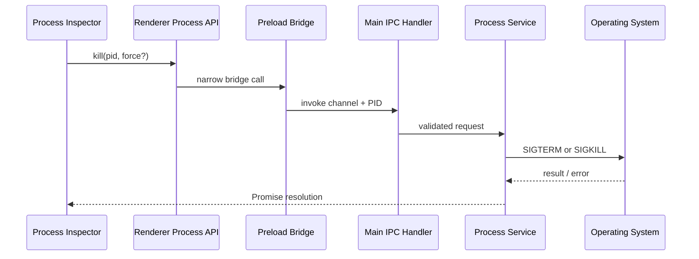

# Process termination lifecycle

Graceful termination sends `SIGTERM`; force termination sends `SIGKILL`. The service refuses to signal ProcessDesk's own main process, and translates `ESRCH` / `EPERM` into readable errors. (On Windows, Node maps both signals to a forced termination.)
